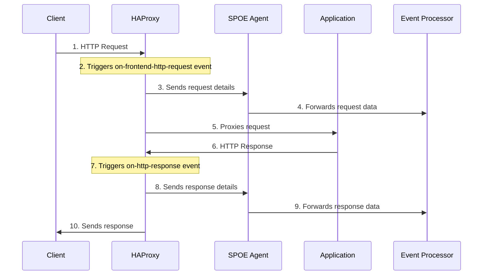

# HAProxy SPOE Sidecar

**HAProxy's Stream Processing Offload Engine (SPOE)** is a powerful feature of HAProxy that allows offloading stream processing tasks to external agents without blocking the main HAProxy process. This is ideal for your use case of capturing and forwarding HTTP requests/responses without impacting performance.

## Understanding HAProxy's SPOE for HTTP Interception

HAProxy's Stream Processing Offload Engine (SPOE) is an ideal solution for your requirement to intercept HTTP requests/responses without affecting performance. Here's how it works:

### What SPOE Does

SPOE allows HAProxy to offload processing tasks to external agents via a binary protocol:

1. **Non-blocking operation** - HAProxy continues processing traffic while SPOE messages are handled asynchronously
2. **High performance** - Minimal impact on HAProxy's main process
3. **Separation of concerns** - Processing logic lives in specialized agents

### The Components

1. **HAProxy Configuration** with SPOE enabled:

   - Defines events for capturing requests and responses
   - Configures connection to the SPOE agent

2. **SPOE Agent** (written in Python):

   - Receives binary SPOE messages from HAProxy
   - Processes request and response data
   - Forwards copies to your downstream processing system

3. **Kubernetes Deployment** showing how to run everything together:
   - Application container
   - HAProxy sidecar with SPOE enabled
   - SPOE agent container

### How It Works - The Flow

The diagram shows the complete flow of HTTP requests and responses through the HAProxy SPOE system:

1. **Initial Request**: The client sends an HTTP request to HAProxy
2. **Request Event**: HAProxy triggers the `on-frontend-http-request` SPOE event
3. **SPOE Processing (Request)**: HAProxy sends the request details to the SPOE Agent
4. **Downstream Forwarding (Request)**: The SPOE Agent forwards the request data to the Event Processor
5. **Application Processing**: HAProxy proxies the original request to the application
6. **Response Generation**: The application processes the request and returns a response to HAProxy
7. **Response Event**: HAProxy triggers the `on-http-response` SPOE event
8. **SPOE Processing (Response)**: HAProxy sends the response details to the SPOE Agent
9. **Downstream Forwarding (Response)**: The SPOE Agent forwards the response data to the Event Processor
10. **Final Response**: HAProxy sends the response back to the client

The key benefit of this architecture is that the SPOE processing happens asynchronously and doesn't block the main request/response flow, ensuring minimal performance impact while still capturing all the HTTP traffic.

### Benefits Over Other Methods

- **Performance**: Minimal impact on main traffic flow
- **Scalability**: SPOE agents can be scaled independently
- **Flexibility**: Complete freedom in how you process the data

### Setup Tips

1. **Test the SPOE agent separately** before deploying to production
2. **Monitor SPOE communication** - add metrics to track latency and errors
3. **Consider batching** for high-traffic environments
4. **Implement proper error handling** in your SPOE agent
